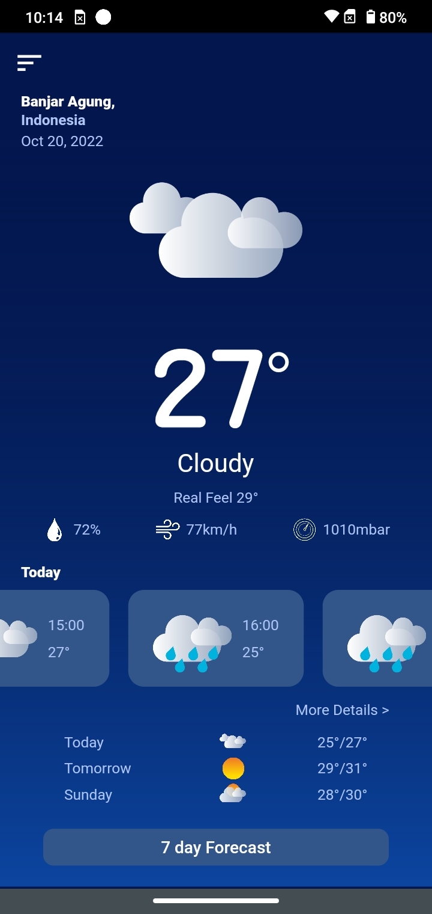
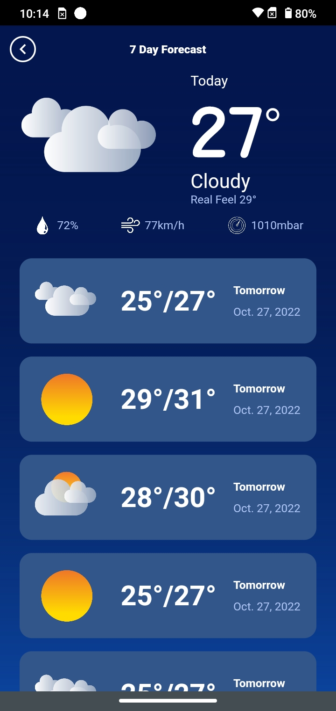

# About Design
Beautiful Weather app template done in flutter. The app shows a summary of today's weather conditions and give a 7 day forecast. This is one of many flutter templates from the [Flutter Mockups](https://fluttermockups.com) project.

 

# Designer Info
Instagram: [sadewo](https://instagram.com/sadewowww?igshid=YmMyMTA2M2Y=)

Original Design: [link](https://www.instagram.com/p/CkHmJjVSOSU/?igshid=YmMyMTA2M2Y=)

# Developer info
Instagram: [gavinpalmer.me](https://fluttermockups.com)

Website: [https://portfolio.gavinpalmer.me](https://portfolio.gavinpalmer.me)

# Demo
Try out this template and others by downloading the Flutter Mockup App.

  

# Features
* Ready to install
* Mock APIs

# Installation
Visit [https://flutter.dev](https://flutter.dev) for instructions to get up and running.